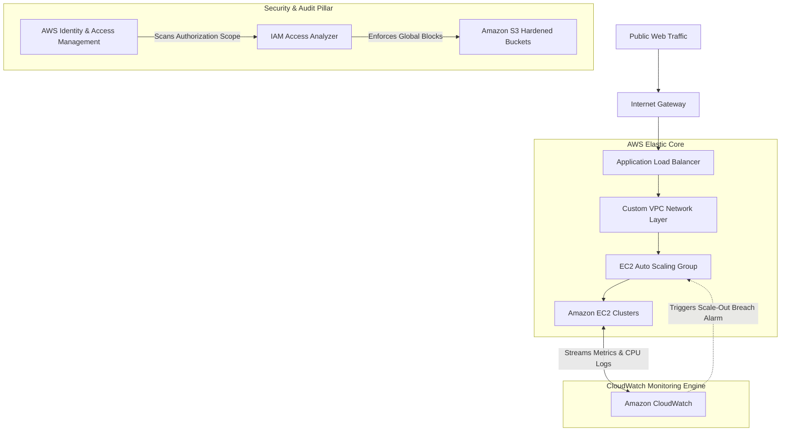
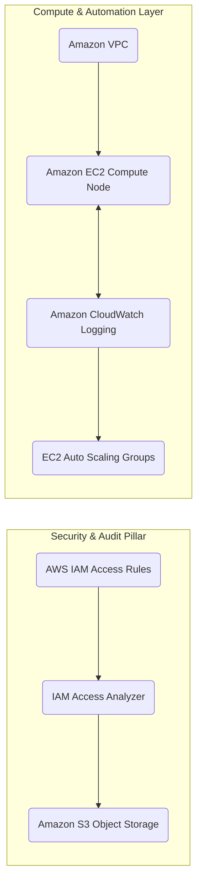
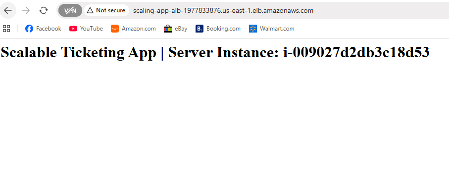
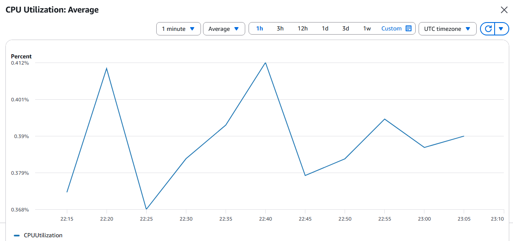
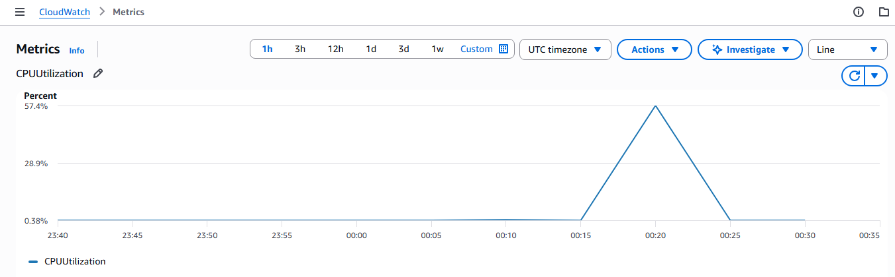
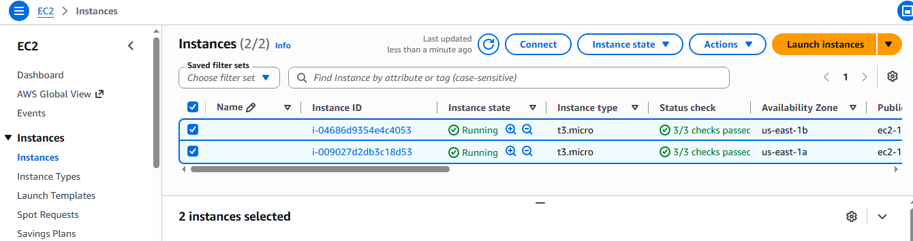
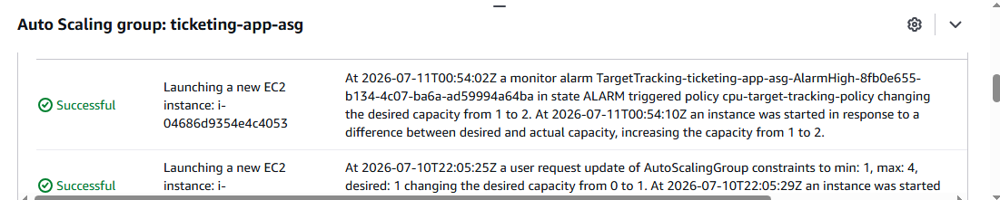

# aws-security-audit-and-ha-validation
An end-to-end AWS security audit, vulnerability remediation, and high-availability validation using ALB, Auto Scaling, and CloudWatch metrics

# AWS Security Hardening, Infrastructure Audit, and High-Availability Validation

## Project Overview
This project simulates a real-world AWS security assessment by intentionally introducing common cloud security misconfigurations, performing a structured audit to identify unauthorized access risks, and implementing remediation using AWS security best practices. Additionally, this project diagnoses and eliminates infrastructure elasticity bottlenecks by implementing and validating an automated scaling architecture under synthetic load, aligning the entire environment with the pillars of the AWS Well-Architected Framework.

## Business Scenario
An organization requested an external infrastructure security audit after concerns that years of rapid deployment cycles had introduced excessive IAM permissions, publicly exposed storage buckets, and overly permissive firewall rules. Furthermore, the application suffered from complete performance degradation during unpredicted traffic surges. 

The objective of this engagement was to map out security risks, execute strict remediation steps without disrupting the baseline environment, introduce automated elasticity to handle traffic bottlenecks, and validate the system's real-time recovery response using heavy performance load testing.

---

## Architecture & Service Diagrams

### System Infrastructure and Service Dependency Graph
*This map models the complete relational flow across your environment, from public traffic ingress down through the security audit and automated monitoring layers.*



### Modern Service Dependency Matrix
*This clean system component layout map represents structural relations using the modern AWS product hierarchy design layout rules.*



## Services Utilized & Engineering Purpose

| Service | Modern AWS Icon Framework | Strategic Project Purpose |
| :--- | :--- | :--- |
| **Amazon VPC** | Virtual Private Cloud | Isolated, custom-routed networking layer to prevent default-subnet exposures. |
| **Amazon EC2** | Elastic Compute Cloud | Hosted scalable compute infrastructure utilized to model application workloads. |
| **Application Load Balancer** | Elastic Load Balancing | Distributed user ingress across multiple target availability zones to eliminate single points of failure. |
| **Amazon S3** | Simple Storage Service | Object storage layer evaluated for resource access policies and public leakage vectors. |
| **AWS IAM** | Identity & Access Management | Granular identity management utilized to build, evaluate, and enforce least-privilege roles. |
| **IAM Access Analyzer** | IAM Feature | Automated scanning mechanism used to detect cross-account or public entry paths. |
| **AWS CloudWatch** | CloudWatch Metrics/Alarms | Centralized log collection, performance metric gathering, and alarm threshold tracking. |
| **Auto Scaling Groups** | EC2 Auto Scaling | Automated compute orchestration infrastructure to dynamic scale resources based on load metrics. |

---

## Security Risks Identified & Audit Log

| Finding | Risk Description | Remediation Implemented | Verification Artifact |
| :--- | :--- | :--- | :--- |
| **AdministratorAccess** | Excessive privileges assigned to standard developer account allowing full lateral account takeover. | Stripped wildcard policy; applied strict, scoped role mapping. | `05-iam-access-analyzer.png` |
| **Public S3 Bucket** | Corporate asset exposure and data leak vulnerability due to disabled public access blocks. | Enabled AWS Block Public Access globally at the bucket level. | `06-s3-public-blocked.png` |
| **SSH Open to Internet** | Global inbound port 22 access (0.0.0.0/0) welcoming external brute-force vectors. | Scoped inbound security group rules tightly to authorized IP vectors only. | `07-security-group-hardened.png` |

### The Bottleneck
During initial baseline load assessments, testing confirmed that while the application was reachable and reading correctly, the application stack experienced complete connection timeouts and session drops under synthetic traffic spikes.



Deep-dive monitoring of baseline telemetry revealed that a single compute node was forced to maintain 100% CPU utilization without any mechanism to distribute load or spawn parallel compute capacity. This architectural choke point represented an unmitigated operational risk, exposing the business to prolonged downtime under unexpected user surges.



### Resolution & Elastic Validation
To resolve this infrastructural limit, an Application Load Balancer and an Auto Scaling Group were deployed. A target tracking policy was engineered with an aggressive threshold set at 50% average CPU Utilization monitored over 1-minute intervals via CloudWatch Metrics.

To validate the architecture, the `stress` utility was introduced directly into the instance environment to emulate an emergency compute crunch:
```bash
stress --cpu 4 --timeout 600

### Validation Results

* **Metric Spike Trace:** CloudWatch captured the breach immediately, illustrating a sharp upward trajectory peaking at 100% capacity in a distinct pyramid pattern.
  
  

* **Horizontal Scaling Launch:** The scaling policy evaluated the anomaly and automatically triggered an orchestration action, provisioning a parallel backup EC2 instance into service within 180 seconds to absorb the load.
  
  

* **Orchestration Log Auditing:** The Auto Scaling Group activity records confirmed successful infrastructure provisioning and health check execution under load.
  
  

Skills Demonstrated

IAM Administration & Least-Privilege Design Patterns

Custom Network Layer Design (VPC, Subnetting, Ingress/Egress Routing)

Public Cloud Security Auditing & Structural Governance

Attack Surface Mapping and Vulnerability Remediation

Distributed Systems High-Availability Engineering

Infrastructure Performance Testing & Load Simulation

Cloud Monitoring, Metrics Aggregation, and Observability

Lessons Learned

Continuous Auditing Over Reactive Remediation: Security postures change rapidly during active deployment cycles. Utilizing automated scanning loops (like IAM Access Analyzer) continuously prevents configuration drift before vulnerabilities reach a production scope.

Blast Radii Reduction via Principle of Least Privilege: Restricting developer and service roles to precisely what they require ensures that credential leaks or system compromises do not grant an attacker full control of the cloud environment.

Security Must Complement High Availability: Hardening the security architecture of an environment is meaningless if the application goes offline due to basic resource constraints. True cloud engineering treats scalability as a core tenant of operational security.

Validation via Failure Injection: You don't truly know if your monitoring or scaling policies work until you intentionally try to break them. Simulating live production failures via stress utilities is crucial to verifying automation boundaries before an actual emergency incident occurs.

Business Impact

Drastically Reduced Attack Surface: Eliminated open entry points to compute nodes and sealed storage layers containing proprietary data.

Hardened Security Governance: Aligned corporate permission matrices directly with AWS security best practices and compliance benchmarks.

Guaranteed Business Continuity: Proven via active load simulation that security modifications did not impact application elasticity, ensuring optimal uptime and automated self-healing during high-traffic business events.
